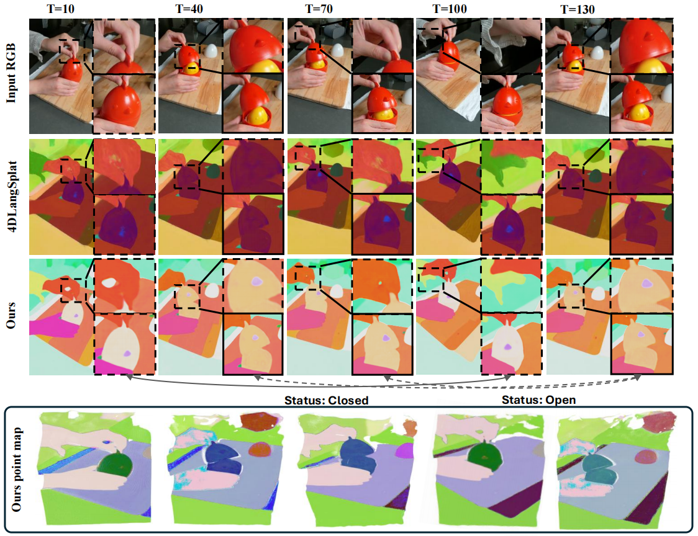

# 4DLangVGGT: 4D Language Visual Geometry Grounded Transformer <br><sub>Official PyTorch Implementation</sub>

#### [<code>Project Page 🤩</code>](https://hustvl.github.io/4DLangVGGT/) | [<code>HF Checkpoint 🚀</code>](https://huggingface.co/YajingB/4DLangVGGT) | [<code>Paper 📝</code>](https://arxiv.org/abs/2512.05060) 

  <p align="center">
    4DLangVGGT: 4D Language Visual Geometry Grounded Transformer
    <br />
    <a href="https://scholar.google.com/citations?user=C9B5JKYAAAAJ&hl=en">Xianfeng Wu<sup>1, 3, 4</sup><sup>#</sup></a>
    ·
    <a href="https://scholar.google.com/citations?user=0bmTpcAAAAAJ&hl=en&oi=ao">Yajing Bai<sup>1, 3</sup><sup>#</sup></a>
    ·
    <a href="https://scholar.google.com/citations?user=LhdBgMAAAAAJ&hl=en">Minghan Li<sup>2</sup></a>
    ·
    <a href="https://openreview.net/profile?id=~Xianzu_Wu1">Xianzu Wu<sup>1, 5</sup></a>
    ·
    <a href="https://github.com/hustvl/4DLangVGGT">Xueqi Zhao<sup>1, 6</sup></a>
    ·
    <a href="https://github.com/hustvl/4DLangVGGT">Zhongyuan Lai<sup>1</sup></a>
    ·
    <a href="https://scholar.google.com/citations?user=D7jDk7gAAAAJ&hl=en">Wenyu Liu<sup>3</sup></a>
    ·
    <a href="https://xwcv.github.io/">Xinggang Wang<sup>3</sup><sup>*</sup></a>
    <br />
    <p align="center"> <sub><sup>1</sup> <a href="https://sklpb.jhun.edu.cn/sklpben/main.htm">State Key Laboratory of Precision Blasting, Jianghan University<sup></a>, <sup>2</sup> <a href="https://wang.hms.harvard.edu/">Harvard AI and Robotics Lab, Harvard University<sup></a>, <sup>3</sup> <a href="http://english.eic.hust.edu.cn/">School of EIC, Huazhong University of Science and Technology<sup></a>, <sup>4</sup> <a href="https://www.polyu.edu.hk/comp/">Department of Computing, The Hong Kong Polytechnic University<sup></a>, <sup>5</sup> <a href="https://www.comp.hkbu.edu.hk/v1/">Department of Computer Science, Hong Kong Baptist University<sup></a>, <sup>6</sup> <a href="https://en.hbnu.edu.cn/CollegeofMathematicsandStatistics/list.htm">School of Mathematics and Statistics, Hubei University of Education<sup></a>, <sup>#</sup>Equal contribution, <sup>*</sup> Corresponding Author</sub></p>
  </p>

  <p align="center">
  
</p>

This is a PyTorch/GPU implementation of [4DLangVGGT]()


## Overview
4DLangVGGT is a feed-forward framework for language-aware 4D scene understanding, combining StreamVGGT for dynamic geometry reconstruction with a Semantic Bridging Decoder (SBD) that aligns geometry tokens with language semantics. Unlike Gaussian Splatting methods that require per-scene optimization, our feed-forward design can be trained across multiple scenes and directly applied at inference, achieving scalable, efficient, and open-vocabulary 4D semantic fields with state-of-the-art performance on HyperNeRF and Neu3D benchmarks.

## Installation

4D LangVGGT uses the following software versions:
- Python 3.10
- CUDA 12.4

First, please clone 4DLangVGGT according to the command below.
```bash
git clone https://github.com/hustvl/4DLangVGGT.git --single-branch
cd 4DLangVGGT
```

Then create a conda environment using the following command:

```bash
# if you lose some pkgs
# apt-get update && apt-get install libgl1 ffmpeg libsm6 libxext6 -y 

pip install torch==2.4.0 torchvision==0.19.0 torchaudio==2.4.0 --index-url https://download.pytorch.org/whl/cu124

pip install -r requirements.txt
```

## Dataset
4DLangVGGT is trained and evaluated on the [HyperNeRF](https://github.com/google/hypernerf) and [Neu3D](https://github.com/facebookresearch/Neural_3D_Video) datasets. Please download the datasets and put them in the folder `./data`. For data processing, please refer to [4DLangSplat](https://github.com/zrporz/4DLangSplat) to generate segmentation map and extract CLIP and Video features.


## QuickStart
### Download Checkpoints
Please download the checkpoint of StreamVGGT from [here](https://github.com/wzzheng/StreamVGGT) and put the checkpoint folder under `./ckpt/streamvggt`

The checkpoint of 4DLangVGGT is availavle at [Hugging Face](https://huggingface.co/YajingB/4DLangVGGT) and put the checkpoint folder under `./ckpt/4dlangvggt`

### Inference
Run the following command to generate the demo:
```bash
bash scripts/infer.sh
```
The results will be saved under `./eval/eval_results`.

## Folder Structure
The overall folder structure should be organized as follows：
```text
4DLangVGGT
|-- ckpt
|   |-- streamvggt
|   |   |-- checkpoints.pth
|   |   |-- model.safetensors
|   |-- 4dlangvggt
|   |   |-- 
|-- data
|   |-- hypernerf
|   |   |-- americano
|   |   |   |-- annotations
|   |   |   |   |-- train
|   |   |   |   |-- README
|   |   |   |   |-- video_annotations.json
|   |   |   |-- camera
|   |   |   |-- rgb
|   |   |   |   |-- 1x
|   |   |   |   |   |-- 000001.png
|   |   |   |   ...
|   |   |   |   |-- 2x
|   |   |   |   |   |-- 000001.png
|   |   |   |-- streamvggt_token
|   |   |   |   |   |-- 000001.npy
|   |   |   ...
|   |   |   |-- dataset.json
|   |   |   |-- metadata.json
|   |   |   |-- points.npy
|   |   |   |-- scene.json
|   |   |   |-- points3D_downsample2.ply
|   |   |-- chickchicken
|   |   ...
|   |-- neu3d
|   |   |-- coffee_martini
|   |   |   |-- annotations
|   |   |   |   |-- train
|   |   ...
```

## Training
### Step1: Generate Geometry Tokens
To reduce the amount of memory required during training, we first preprocess the video using StreamVGGT, extract the geometry tokens, and save them in the folder `./data/<dataset>/<class>/streamvggt_token`. Take the americano class from the HyperNeRF dataset as an example, you need to ensure the extracted geometry tokens are in the folder `./data/hypernerf/americano/streamvggt_token`.
```bash
python preprocess/generate_vggttoken.py \
    --categories americano \
    --img_root data/hypernerf \
    --ckpt ckpt/streamvggt/checkpoints.pth \
    --max_num 128 \
    --device cuda
```

### Step2: Train 4DLangVGGT
We provide the following commands for training.
```bash
torchrun --nproc_per_node=1 --nnodes=1 --node_rank=0 train.py --batch_size 8 \
                --data_root YOUR_DATA_ROOT --streamvggt_ckpt_path YOUR_STREAMVGGT_CKPT  \
                --num_workers 0 --output_dir unify_hyper_clip --mode gt --cos --wandb --joint_train \
                --feat_root clip_features-all_dim3 \
```

### 🏄 Top contributors:

<!-- <a href="https://github.com/hustvl/4DLangVGGT/graphs/contributors">
  
</a> -->
<a href="https://github.com/hustvl/4DLangVGGT/graphs/contributors">
  
</a>

## Acknowledgements
Our code is based on the following brilliant repositories:

- [StreamVGGT](https://github.com/wzzheng/StreamVGGT)

- [VGGT](https://github.com/facebookresearch/vggt)

- [4DLangSplat](https://github.com/zrporz/4DLangSplat)

Many thanks to these authors!

## License

Released under the [MIT](LICENSE) License.
